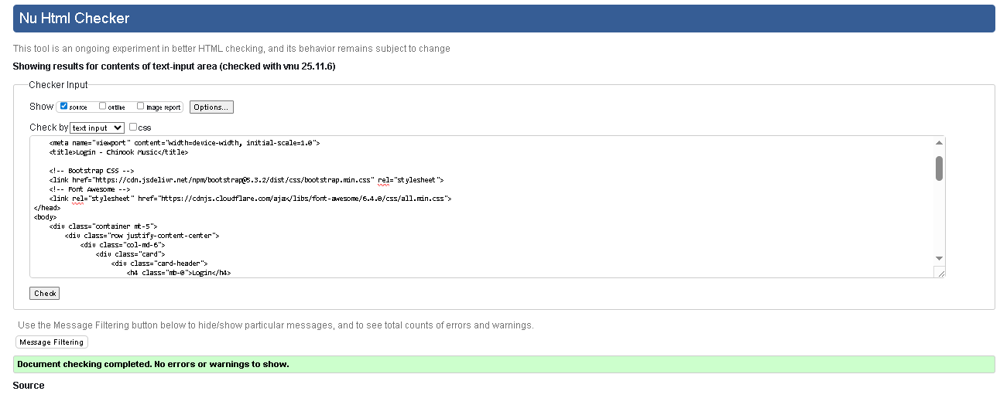

# 🎵 Chinook Music Database Project

## 🤖 AI Assistance Disclosure
Portions of this project were developed with the assistance of AI tools such as **GitHub Copilot** and **ChatGPT**.  
These tools were used to help with tasks including code generation, debugging, documentation writing, and UI/UX suggestions.

# 🎵 Chinook Music Database


## 🌐 Live Application
[Visit the Chinook Music Database](https://chinookmusicdbpro-1a8fd737fe52.herokuapp.com//)

---

## 📋 Project Overview
The **Chinook Music Database** is a Django-based web application that enables users, administrators, and store owners to manage artists, albums, tracks, and playlists with full CRUD functionality. Built with Django, PostgreSQL, and Bootstrap, it offers secure authentication, advanced search, and a responsive, music-themed interface. Developed using agile methodology, it focuses on user-centered design, efficient data management, and accessibility across all devices.

---

## 🧭 Table of Contents
- [User Stories](#user-stories)
- [UX Design](#ux-design)
- [Features](#features)
- [Agile Development](#agile-development)
- [Testing and Validation](#testing-and-validation)
- [Deployment](#deployment)
- [AI Implementation](#ai-implementation)
- [Credits](#credits)

---

## 👥 User Stories

### **Must Have**
- Register an account to access personalized features  
- Log in securely to manage music data  
- Browse artists, albums, and tracks  
- Search for specific music content  
- Add, edit, and delete artists/albums (admin users)

### **Should Have**
- Create and manage personal playlists  
- Reset passwords using security questions  
- View activity history  
- See confirmation messages for user actions  

### **Could Have**
- Listen to track previews  
- Rate and review albums  
- Share content on social media  
- Export playlists for use in other apps  

---

## 🎨 UX Design

### 🎨 Colour Scheme
- A **music-inspired dark theme** for media focus  
- High contrast and vibrant accents for readability and engagement  
- Fully responsive across all devices  


### 🖼️ Wireframes
Wireframes were designed to visualize the core structure:

- Homepage – Featured music & catalog navigation  
- Artist/Album pages – Detailed listings  
- Admin Dashboard – CRUD management interface  


---

## ✨ Features

### **Current Features**
- **Home Page:** Displays featured artists, recent additions, and easy navigation  
  

- **User Authentication:** Secure login and registration with password recovery via custom security questions  
  

- **Music Catalog:** Browse, filter, and search artists, albums, and tracks  
  

- **Admin Dashboard:** Full CRUD operations with easy-to-use forms  
  

- **Playlist Management:** Create, edit, and manage user playlists  
  

- **Responsive Design:** Optimized for mobile, tablet, and desktop  
  

### **Planned Features**
- Music preview audio integration  
- Album rating and review system  
- Social media sharing  
- Analytics dashboard  
- Playlist import/export  

---

## 🧩 Technology Stack

- **Backend:** Django 5.2.7, Python 3.12.10  
- **Frontend:** HTML5, CSS3, JavaScript, Bootstrap 5  
- **Database:** PostgreSQL  
- **Deployment:** Heroku / Render  
- **Authentication:** Django Allauth  
- **Static Files:** WhiteNoise  

---

## 🚀 Installation & Setup

### Prerequisites
- Python 3.12+
- PostgreSQL
- pip

### Steps
```bash
# Clone the repository
git clone https://github.com/arokhlo/ChinookMusicDbProj.git
cd ChinookMusicDbProj

# Create virtual environment
python -m venv venv
source venv/bin/activate  # On Windows: venv\Scripts\activate

# Install dependencies
pip install -r requirements.txt

# Set up the database
python manage.py migrate
python manage.py loaddata chinook_data.json  # Optional: load sample data

# Create a superuser
python manage.py createsuperuser

# Run the development server
python manage.py runserver_plus --cert-file cert.crt --key-file cert.key